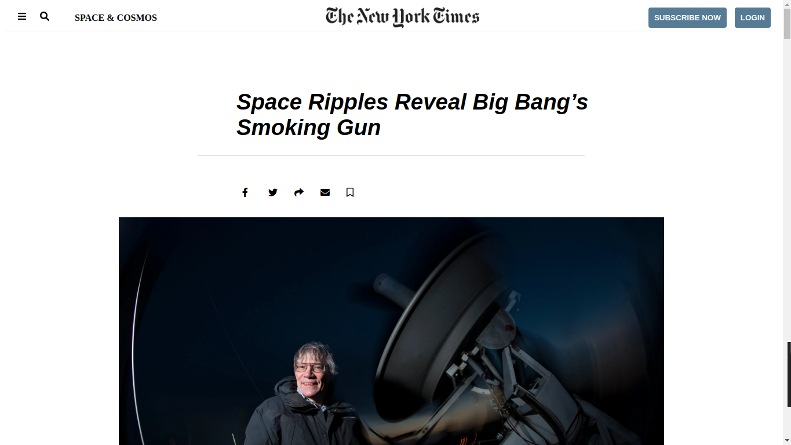

## Project1: New York Times Clone

> New York Times article Project

This project features HTML5 semantic tags, CSS float, CSS flexbox, and Grid.

## Built With

- HTML5 & CSS3

## Live Demo

[Live Demo Link]()

### Prerequisites

Knowledge of HTML Semantics and CSS Box model

## Authors

👤 **Makungong Collins Tatang**

- GitHub: [@CollinsTatang](https://github.com/CollinsTatang)
- Twitter: [@CollinsTatang](https://twitter.com/CollinsTatang)
- LinkedIn: [makungong collins](https://www.linkedin.com/in/makungong-collins-b43260190/)

👤 **Ntazama Willy**

- GitHub: [@ntzwilly](https://github.com/ntzwilly)
- Twitter: [@WNtazama](https://twitter.com/WNtazama)
- LinkedIn: [ntazama willy](https://www.linkedin.com/in/ntazama-willy-b676b7aa/)

## 🤝 Contributing

Contributions, issues, and feature requests are welcome!

Feel free to check the [issues page](issues/).

## Show your support

Give a ⭐️ if you like this project!

## Acknowledgments

- Hat tip to anyone whose code was used
- Inspiration
- etc

## 📝 License

This project is [MIT](lic.url) licensed.
